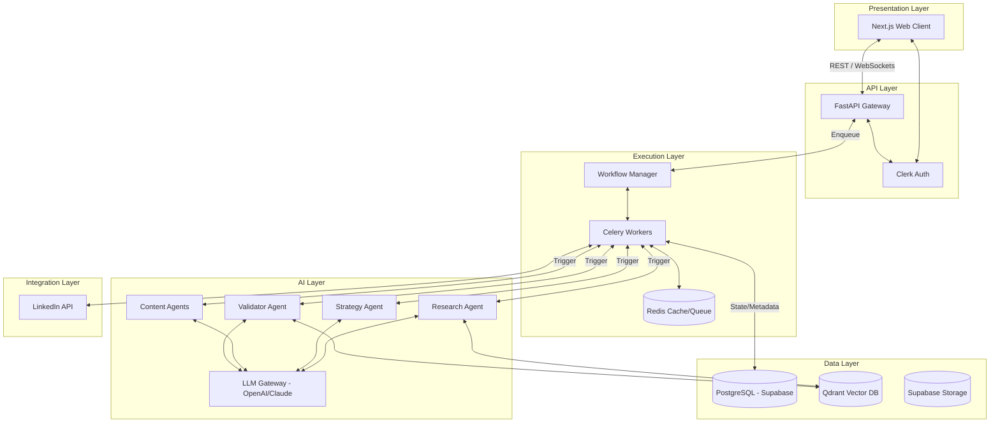

## 1. Executive Summary

This document defines the technical architecture for Version 1 of the Autonomous Marketing Operations Engine. The system is designed to translate high-level natural language business goals into fully executed, multi-step marketing campaigns.

To achieve the vision of "Outcome-Driven Autonomous Execution" outlined in the PRD, the architecture relies on a deterministic state machine that orchestrates stochastic Large Language Model (LLM) calls. The architecture strictly separates the orchestration layer from the intelligence layer, ensuring high reliability, clear error boundaries, and seamless human-in-the-loop (HITL) intervention. Version 1 is purposefully constrained to a fixed, multi-agent Directed Acyclic Graph (DAG) for LinkedIn campaign generation, optimized for small marketing agencies.

---

## 2. High-Level Architecture

The system is composed of seven distinct layers, ensuring loose coupling and high cohesion.

* **Presentation Layer:** A Next.js front-end deployed on Vercel. Provides the user interface for intent capture, real-time workflow visualization, and the WYSIWYG approval dashboard.
* **API Layer:** A FastAPI backend exposing RESTful endpoints. It handles request validation, authentication routing via Clerk, and delegates complex processing to the execution layer.
* **Execution Layer:** A Celery-based asynchronous task queue backed by Redis. This is the core orchestrator (the "Execution Engine") that manages the state machine, triggers agents, handles retries, and enforces checkpoints for human approval.
* **AI Layer:** The abstraction over frontier LLMs (OpenAI, Anthropic, Gemini). It contains the distinct system prompts, contextual logic, and validation protocols for each specialized AI Agent.
* **Data Layer:** A Supabase-hosted PostgreSQL relational database for structured state and user data, combined with Qdrant for vector storage (brand guidelines, semantic search) and Supabase Storage for unstructured assets.
* **Integration Layer:** Adapters for external systems, specifically the LinkedIn API for post scheduling and analytics ingestion.
* **Infrastructure Layer:** The deployment and observability foundation, utilizing Vercel, Render/Railway, GitHub Actions, Sentry, Langfuse, and OpenTelemetry.

---

## 3. System Diagram



---

## 4. Frontend Architecture

The frontend is a strictly typed React application utilizing the Next.js App Router paradigm.

* **Framework:** Next.js (React)
* **Language:** TypeScript
* **Styling:** Tailwind CSS + Radix UI (or shadcn/ui) for accessible, headless components.
* **State Management:** * *Server State:* React Query (TanStack Query) for fetching, caching, and synchronizing backend data.
* *Client State:* Zustand for lightweight, global client state (e.g., multi-step form progress, active workspace).


* **Routing:** Next.js App Router (`/app` directory) utilizing server components for initial data fetching and client components for interactive UI (the approval dashboard).
* **Authentication Flow:** Clerk Provider wraps the application. Middleware protects `/dashboard` routes, redirecting unauthenticated users. Clerk handles OAuth and session management, passing a JWT to the backend for API authorization.

---

## 5. Backend Architecture

The backend is built for high concurrency and I/O-bound AI operations.

* **Framework:** FastAPI (Python)
* **Architecture Pattern:** Modular Monolith utilizing Domain-Driven Design (DDD) principles.
* **Dependency Injection:** FastAPI's native `Depends` system for injecting database sessions, external clients, and configuration securely.
* **Task Queue:** Celery handles long-running AI orchestration. The FastAPI thread only validates requests and enqueues tasks, returning a `task_id` for the frontend to poll (or listen via WebSockets).
* **Modules:**
* `core`: Config, security, database session management, logging.
* `api`: API routers and endpoints.
* `domain`: Business logic, Celery task definitions, workflow managers.
* `infrastructure`: Third-party clients (LLMs, LinkedIn, Qdrant).


---

## 6. Execution Engine

The Execution Engine is the heart of the platform. It enforces deterministic progression through a fixed DAG of stochastic tasks.

* **Planner:** Parses the natural language intent into a structured JSON configuration (Goal, Constraints, Parameters).
* **Workflow Manager:** A database-backed state machine. It records the state of every workflow run (e.g., `PENDING`, `RESEARCHING`, `AWAITING_APPROVAL`, `COMPLETED`, `FAILED`).
* **Task Scheduler:** Celery orchestrates the asynchronous execution. When Step A completes, the worker updates the Workflow Manager in PostgreSQL, which enqueues Step B.
* **Agent Router:** Maps specific workflow steps to the corresponding AI Agent Python classes.
* **Execution Context:** A shared JSON object representing the current state of the campaign (e.g., research findings, strategy). Passed down the DAG to provide context to subsequent agents.
* **Retry Logic:** Implements exponential backoff via Celery for external API failures (e.g., LLM rate limits, network timeouts).
* **Recovery Logic:** Idempotent task design ensures that if a worker dies mid-task, re-running the task will not corrupt the database.
* **Checkpointing & Human Approval:** When the workflow reaches the `Brand Validation` step, the Workflow Manager updates the state to `AWAITING_APPROVAL` and halts execution. The frontend detects this state, displays the WYSIWYG editor, and upon user approval, sends an API request to resume the pipeline.

---

## 7. AI Agent Architecture

Agents are encapsulated Python classes with strict input schemas, system prompts, and output schemas (enforced via Pydantic and LLM function calling/structured outputs).

* **Research Agent:**
* *Inputs:* Goal, Target Audience, Client Domain.
* *Responsibilities:* Web scraping, SERP analysis.
* *Outputs:* Structured `ContextDocument`.


* **Strategy Agent:**
* *Inputs:* `ContextDocument`, Goal.
* *Responsibilities:* Defines campaign cadence, narrative arcs, and post formats.
* *Outputs:* `CampaignArchitecture` JSON.


* **Copywriter Agent:**
* *Inputs:* `CampaignArchitecture`, Topic.
* *Responsibilities:* Drafts standard text posts.
* *Outputs:* List of `TextPost` objects.


* **Carousel Agent:**
* *Inputs:* `CampaignArchitecture`, Topic.
* *Responsibilities:* Drafts multi-slide outlines.
* *Outputs:* List of `CarouselSlide` objects.


* **Image Prompt Agent:**
* *Inputs:* Drafted posts/slides.
* *Responsibilities:* Generates descriptive Midjourney/DALL-E prompts.
* *Outputs:* Image prompt strings attached to post objects.


* **Validator Agent:**
* *Inputs:* All drafted content, Vector representations of Brand Guidelines (from Qdrant).
* *Responsibilities:* Adversarial review against brand voice, constraint checking. Flags violations.
* *Outputs:* `ValidationReport` (Pass/Fail with inline corrections).


* **Publisher Agent:**
* *Inputs:* Approved campaign package.
* *Responsibilities:* Maps data to LinkedIn API schema and handles temporal scheduling.
* *Outputs:* Success/Failure metrics.


* **Analytics Agent:**
* *Responsibilities:* Ingests post-campaign engagement data for future context.


---

## 8. Memory Architecture

Memory allows the system to learn and enforce brand consistency.

* **Conversation Memory:** Short-term state passed through the Execution Context during a single workflow run.
* **Campaign Memory:** PostgreSQL records of historical campaigns, tracking what was generated versus what the user actually approved (capturing human edits).
* **User/Workspace Memory:** Settings, API keys, and configurations specific to the agency or client workspace.
* **Brand Memory (Semantic):** Unstructured text (brand guidelines, tone of voice PDFs, successful past posts) chunked, embedded via OpenAI embedding models, and stored in Qdrant.
* **Knowledge Base / Vector Search:** When the Copywriter Agent drafts a post, it queries Qdrant to retrieve the top 3 most relevant historical posts from that workspace to mimic the exact structural tone.

---

## 9. Database Architecture

The PostgreSQL database utilizes Row Level Security (RLS) via Supabase for tenant isolation.

* **Workspaces:** Represents the marketing agency's client. Contains settings, integrations (LinkedIn OAuth tokens).
* **Users:** Agency employees. Mapped to Workspaces via a many-to-many junction table.
* **Campaigns:** The parent entity for a workflow run. Tracks high-level goal, status, and overall timestamps.
* **Tasks:** Child records of Campaigns. Tracks individual agent executions, inputs, outputs, tokens used, and latency.
* **Assets:** The actual generated content (Posts, Carousels, Image Prompts). Linked to a Campaign. Contains `draft_content` and `approved_content` columns to track human modifications.
* **Brand_Guidelines:** Metadata and Qdrant reference IDs for uploaded brand documentation.

---

## 10. API Architecture

* **Standard:** RESTful JSON APIs.
* **Authentication:** Middleware intercepts requests, verifies the Clerk JWT, and injects the authenticated `user_id` and `workspace_id` into the request context.
* **Rate Limiting:** Redis-backed sliding window rate limiting based on `workspace_id` to prevent LLM abuse.
* **Versioning:** URL-based versioning (e.g., `/api/v1/campaigns`).
* **Error Handling:** Centralized exception handlers return standardized HTTP status codes and JSON error schemas (e.g., `{"error": "Validation Error", "code": 400, "details": [...]}`).

---

## 11. Security Architecture

* **Authentication:** Delegated to Clerk (handles SSO, MFA, session hijacking prevention).
* **Authorization:** Role-Based Access Control (RBAC). Only Account Managers/Owners can approve campaigns. Enforced at the API route level and database RLS level.
* **Secrets Management:** Environment variables managed securely in Vercel/Render. Never hardcoded.
* **Encryption:** LinkedIn OAuth tokens and API keys are encrypted at rest in PostgreSQL using AES-256-GCM.
* **Prompt Injection Protection:** Inputs are strictly sanitized. LLM calls utilize system prompts that strictly delineate between user input and system instructions. The Validator Agent acts as a secondary firewall against anomalous outputs.
* **Audit Logs:** Every state change in the Workflow Manager is logged immutably, ensuring accountability for autonomous actions.

---

## 12. Scalability Strategy

* **Horizontal Scaling:** The FastAPI web servers and Celery worker nodes are stateless and can be scaled horizontally based on CPU/Memory metrics.
* **Background Workers:** The Celery queue architecture inherently protects the web server from being blocked by 60-second LLM calls.
* **Caching:** Redis caches frequent, static database queries (e.g., workspace settings) to reduce PostgreSQL load.
* **Database Connections:** PgBouncer (native to Supabase) handles connection pooling to prevent database connection exhaustion under load.

---

## 13. Observability

* **Logging:** Structured JSON logging (Python `logging` module) aggregating to a central log management system.
* **Tracing (System):** OpenTelemetry instruments FastAPI and Celery to trace request paths and identify bottlenecks.
* **Tracing (AI):** Langfuse captures every LLM prompt, response, latency, and token cost. This is critical for debugging agent hallucinations and calculating unit economics.
* **Metrics & Alerts:** Sentry captures unhandled exceptions. Alerts are routed to an engineering Slack channel for critical failures (e.g., Redis unavailability, LLM provider outages).

---

## 14. Deployment Architecture

* **Development:** Local Docker Compose environment (PostgreSQL, Redis, API, Worker, Next.js).
* **Staging:** Exact replica of production. Triggers on merges to the `main` branch.
* **Production:** Triggers on tagged releases.
* **CI/CD:** GitHub Actions manages linting, testing, and deployment.
* Frontend deploys via Vercel GitHub integration.
* Backend builds Docker containers and pushes to a container registry for deployment on Render/Railway.
* Database schema migrations are managed via Alembic (Python).


---

## 15. Recommended Folder Structure

```text
monorepo/
├── web/                           # Next.js Frontend
│   ├── app/
│   │   ├── (auth)/
│   │   ├── dashboard/
│   │   ├── api/                   # Next.js API Routes (BFF)
│   │   └── layout.tsx
│   ├── components/
│   │   ├── ui/                    # Base UI components
│   │   └── workflow/              # Workflow visualization components
│   ├── lib/                       # API clients, utils
│   └── store/                     # Zustand stores
├── api/                           # FastAPI Backend
│   ├── alembic/                   # Database migrations
│   ├── src/
│   │   ├── core/                  # Config, security, DB setup
│   │   ├── api/
│   │   │   ├── v1/                # API Routers
│   │   │   └── dependencies.py    # FastAPI depends
│   │   ├── domain/
│   │   │   ├── agents/            # AI Agent implementations
│   │   │   ├── models/            # SQLAlchemy ORM models
│   │   │   ├── schemas/           # Pydantic schemas
│   │   │   ├── services/          # Business logic
│   │   │   └── workflows/         # Celery tasks & DAG definitions
│   │   ├── infrastructure/
│   │   │   ├── llm/               # OpenAI/Anthropic clients
│   │   │   ├── vector/            # Qdrant client
│   │   │   └── social/            # LinkedIn client
│   │   └── worker.py              # Celery app entrypoint
│   ├── requirements.txt
│   └── Dockerfile
├── docker-compose.yml
└── .github/
    └── workflows/

```

---

## 16. Technology Decisions

* **Next.js + Vercel:** Provides the fastest time-to-market for React applications, seamless edge caching, and excellent developer ergonomics.
* **FastAPI:** Python is the undisputed language of AI. FastAPI provides high performance (ASGI), native async support, and automatic OpenAPI documentation.
* **PostgreSQL (Supabase):** Relational data requires ACID compliance. Supabase provides enterprise-grade Postgres with built-in connection pooling and Row Level Security.
* **Qdrant:** Highly performant vector database written in Rust. Scales better than pgvector for massive embeddings and provides robust filtering capabilities.
* **Redis + Celery:** The industry standard for robust, distributed Python background tasks. Essential for managing long-running LLM calls and retry logic safely.
* **Clerk:** Offloads the immense complexity and security risk of authentication, session management, and B2B organizational structures.
* **Langfuse:** Standard APMs (like Datadog) do not capture the nuance of LLM token usage, prompt variations, and generation evaluation. Langfuse is purpose-built for LLM observability.

---

## 17. Future Evolution

While Version 1 hardcodes the execution graph for LinkedIn campaigns, the architecture is designed to support the Phase 3 Vision: Universal Outcome-Driven Execution.

To transition to V2/V3:

1. The `Workflow Manager` will evolve from executing fixed Celery DAGs to executing dynamic graphs generated by a master "Orchestrator LLM."
2. The `Integration Layer` will be replaced by Anthropic's Model Context Protocol (MCP), allowing the backend to dynamically discover and utilize hundreds of SaaS tools without hardcoding API clients.
3. The state machine will migrate from Celery to a specialized orchestration engine like Temporal, which provides native, indestructible execution state for dynamic, endlessly running, looping agentic workflows.